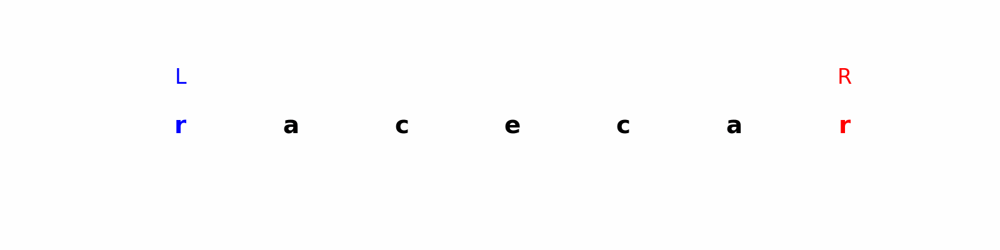

# 🧭 Two Pointers

The **Two Pointers** technique is one of the most commonly used patterns in algorithms and data structures.  
It is especially useful when dealing with arrays, strings, or linked lists, and can often reduce the complexity of a problem from **O(n²)** to **O(n)**.

---

## 💡 Concept
The idea is to use **two indices (pointers)** that traverse a data structure simultaneously:
- They can start from **opposite ends** and move towards each other.
- Or start together and move in the **same direction** at different speeds.
- Movement depends on the conditions defined by the problem.

---

## ✅ When to Use
- Searching for pairs/triplets in a sorted array.
- Checking if a string/array is a palindrome.
- Merging two sorted lists/arrays.
- Partitioning problems (e.g., quicksort).
- Removing/duplicating elements in-place.

---

## 📊 Time Complexity
- Most problems can be solved in **O(n)** time.
- Space complexity is usually **O(1)** (in-place operations).

---

## 📑 Example Problems
Here are some classic problems solved with Two Pointers:
- [Reverse String](reverse_string.py)  
- [Valid Palindrome](valid_palindrome.py)  
- [Merge Sorted Array](merge_sorted_array.py)  

---

## 🔎 Example Visualization
For a palindrome check:
```
Input: "racecar"

l → r

r ← l

Step 1: compare s[l] and s[r] → 'r' == 'r'

Step 2: move l →, r ←

Step 3: compare 'a' == 'a'

Step 4: move again...

Step 5: middle reached → palindrome confirmed

```

## Visualization




---

## 🚀 Benefits
- **Efficiency**: Avoids nested loops.
- **Simplicity**: Easy to reason about and implement.
- **Versatility**: Works in arrays, strings, and linked lists.

---

## 📚 Further Reading
- [LeetCode Explore: Two Pointers](https://leetcode.com/explore/learn/card/array-and-string/205/array-two-pointer-technique/)  
- [GeeksforGeeks: Two Pointers Technique](https://www.geeksforgeeks.org/two-pointers-technique/)  
